# SkillSwap

> A freelance marketplace SPA built with **Angular 21** where job owners post work and freelancers submit proposals, negotiate, and leave reviews once work is done.

---

## Table of Contents

1. [Overview](#overview)
2. [Tech Stack](#tech-stack)
3. [Project Structure](#project-structure)
4. [Architecture Overview](#architecture-overview)
5. [Module & Layer Diagram](#module--layer-diagram)
6. [Domain Models](#domain-models)
7. [Routing Map](#routing-map)
8. [Authentication Flow](#authentication-flow)
9. [HTTP Layer & Interceptor Chain](#http-layer--interceptor-chain)
10. [State Management](#state-management)
11. [Use Cases & Sequence Diagrams](#use-cases--sequence-diagrams)
    - [UC1 — Register & Login](#uc1--register--login)
    - [UC2 — Post a Job](#uc2--post-a-job)
    - [UC3 — Search & Apply for a Job](#uc3--search--apply-for-a-job)
    - [UC4 — Accept a Proposal & Start Work](#uc4--accept-a-proposal--start-work)
    - [UC5 — Complete a Job](#uc5--complete-a-job)
    - [UC6 — Leave a Review](#uc6--leave-a-review)
    - [UC7 — Language & Theme Switch](#uc7--language--theme-switch)
12. [Navbar Badge Reactivity](#navbar-badge-reactivity)
13. [i18n Architecture](#i18n-architecture)
14. [Getting Started](#getting-started)

---

## Overview

SkillSwap connects **job owners** (people who need work done) with **freelancers** (people who provide skills). The lifecycle of an engagement is:

```
Open Job → Proposal Submitted → Proposal Accepted → Job In-Progress → Job Completed → Reviews Left
```

Both sides can leave one review per completed job. The platform tracks open jobs and pending bids in real-time badge counters on the navbar.

---

## Tech Stack

| Layer | Technology |
|---|---|
| Framework | Angular 21 (standalone components) |
| Language | TypeScript 5 |
| Styling | SCSS + DaisyUI / Tailwind CSS |
| State | Angular Signals (`signal`, `computed`) |
| HTTP | Angular `HttpClient` via a typed `ApiClient` wrapper |
| Auth | JWT stored in `localStorage`; attached via HTTP interceptor |
| i18n | Custom signal-based service + JSON locale files (EN / FR) |
| Testing | Vitest |
| Build | Angular CLI |

---

## Project Structure

```
src/app/
├── core/                    # Singleton infrastructure (loaded once)
│   ├── auth/                # AuthStore — JWT session signals
│   ├── config/              # API base URL
│   ├── guards/              # Route guards
│   ├── http/                # ApiClient wrapper + error normalisation
│   ├── i18n/                # I18nService, TranslatePipe, loader
│   ├── interceptors/        # JWT attachment + 401 redirect
│   ├── models/              # Domain types + request/response DTOs
│   ├── navbar/              # NavbarStore — reactive badge counts
│   ├── services/            # Domain services (jobs, proposals, …)
│   ├── theme/               # ThemeService — light/dark toggle
│   └── utils/               # Dev logger, utility pipes
│
├── features/                # Page-level feature modules
│   ├── auth/                # Login, Register
│   ├── jobs/                # JobSearch, JobCreate, JobEdit, JobDetails,
│   │                        # MyPostings, JobList (reusable list)
│   ├── platform/            # Stats dashboard
│   ├── proposals/           # JobProposals, MyBids, ProposalCreate
│   ├── reviews/             # ReviewSubmit, JobReviews, UserReviews
│   └── users/               # ProfileMe, PublicProfile
│
├── layout/                  # Shell components: Header, Footer, Navbar, Sidebar
│
└── shared/                  # Reusable UI: alerts, spinner, modal,
                             # rating-stars, form helpers, confirm-dialog
```

---

## Architecture Overview

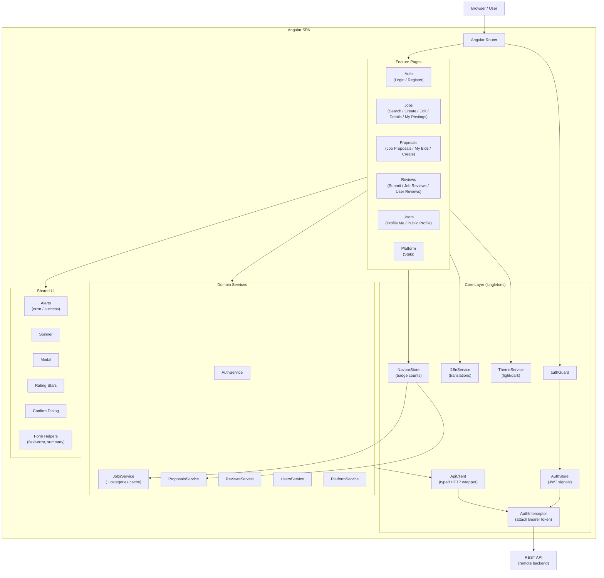

---

## Module & Layer Diagram

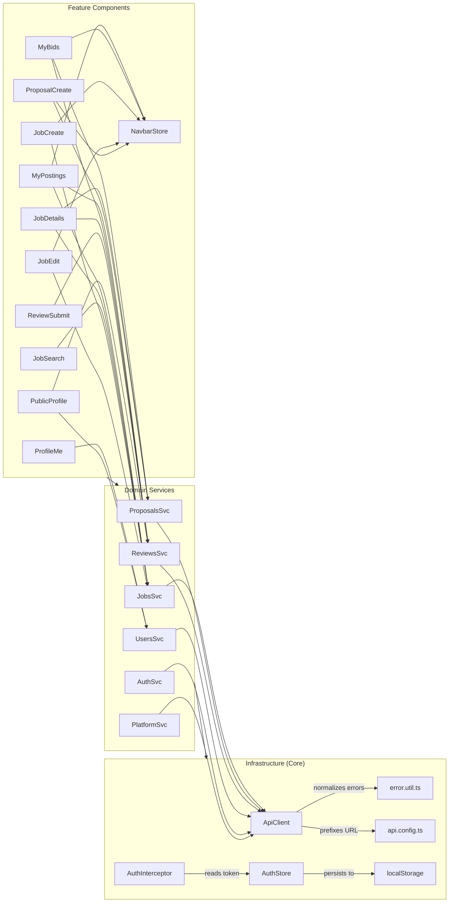

---

## Domain Models

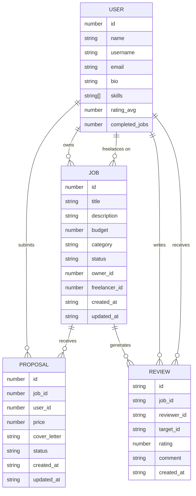

---

## Routing Map

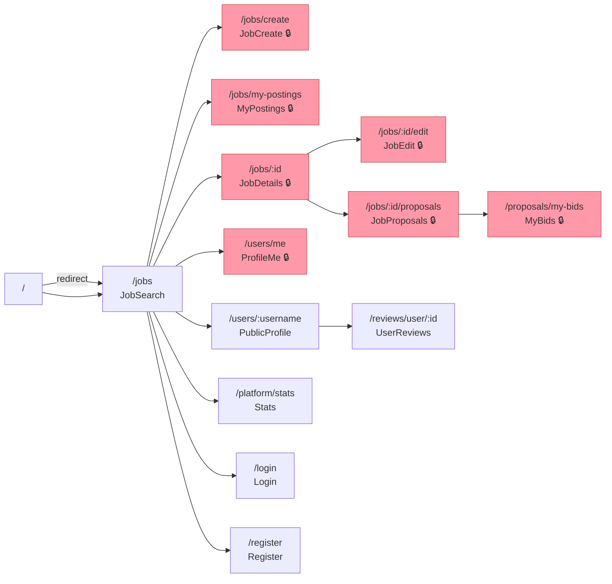

> Routes marked 🔒 require authentication via `authGuard`.

---

## Authentication Flow

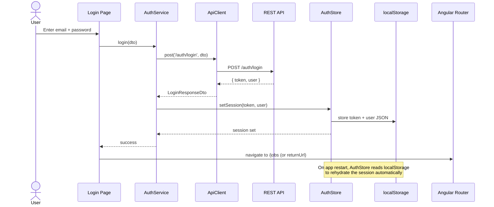

### Token Expiry / 401 Handling

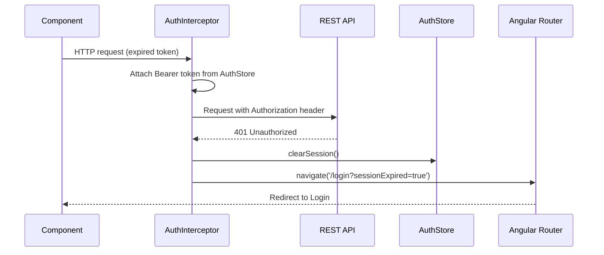

---

## HTTP Layer & Interceptor Chain

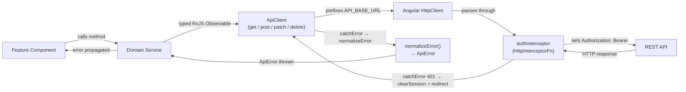

---

## State Management

SkillSwap uses **Angular Signals** for all reactive state — no NgRx or other external store library.

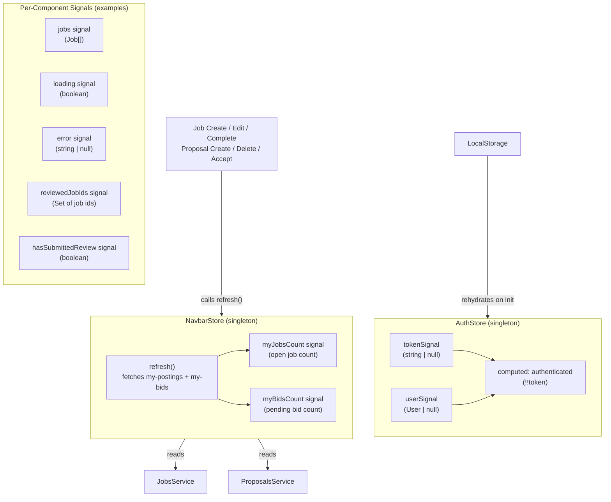

> Every mutation that affects badge counts (create job, delete bid, accept proposal, complete job) calls `navbarStore.refresh()` to keep the navbar in sync.

---

## Use Cases & Sequence Diagrams

### UC1 — Register & Login

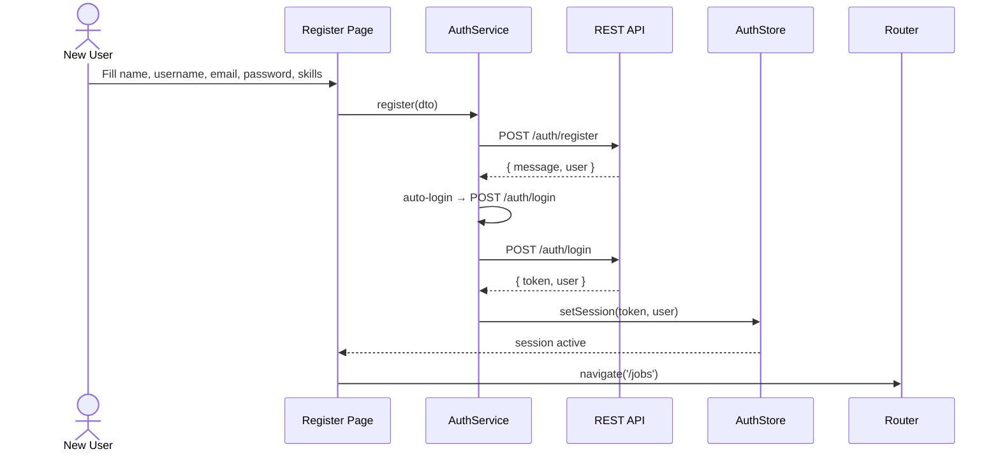

---

### UC2 — Post a Job

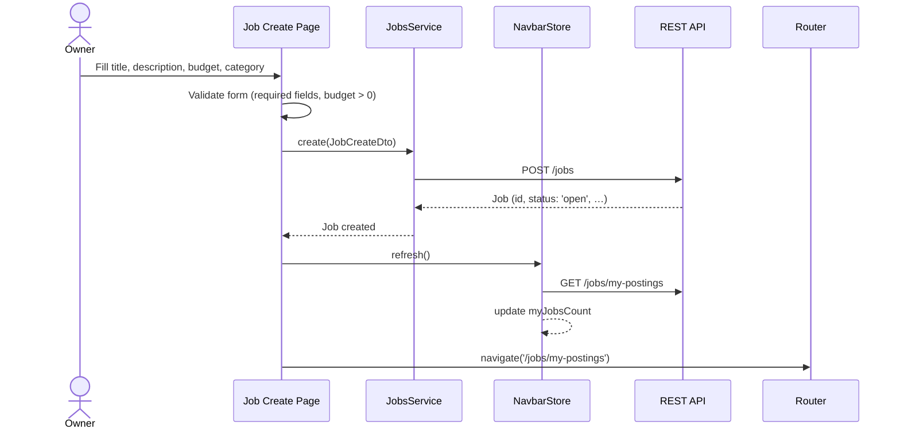

---

### UC3 — Search & Apply for a Job

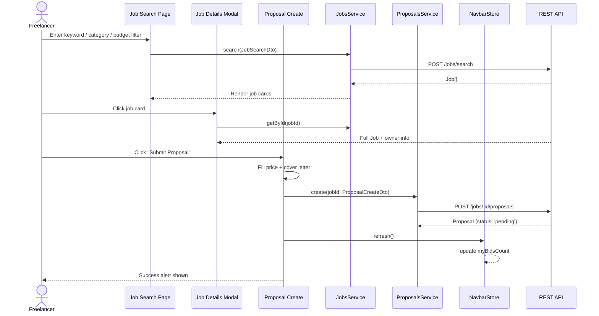

---

### UC4 — Accept a Proposal & Start Work

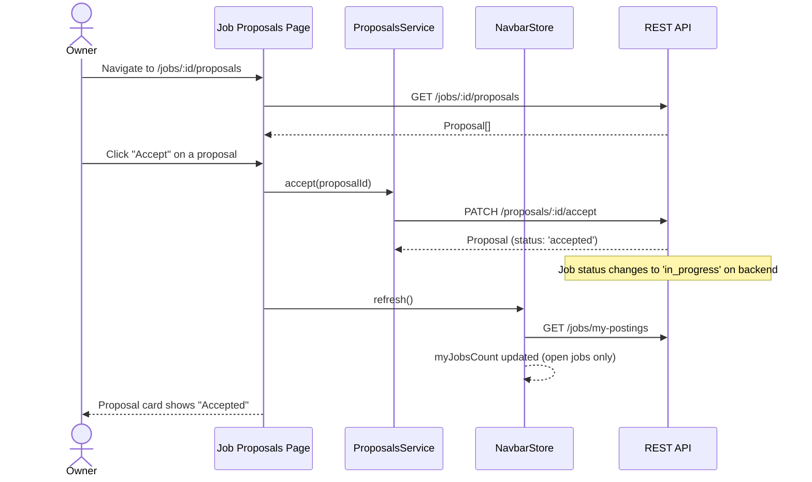

---

### UC5 — Complete a Job

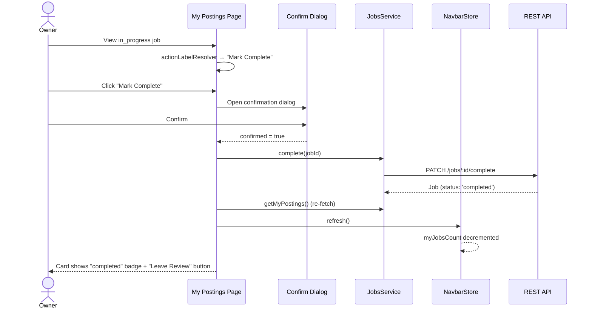

---

### UC6 — Leave a Review

Both the **job owner** (reviewing the freelancer) and the **freelancer** (reviewing the owner) can leave one review each after a job is completed.

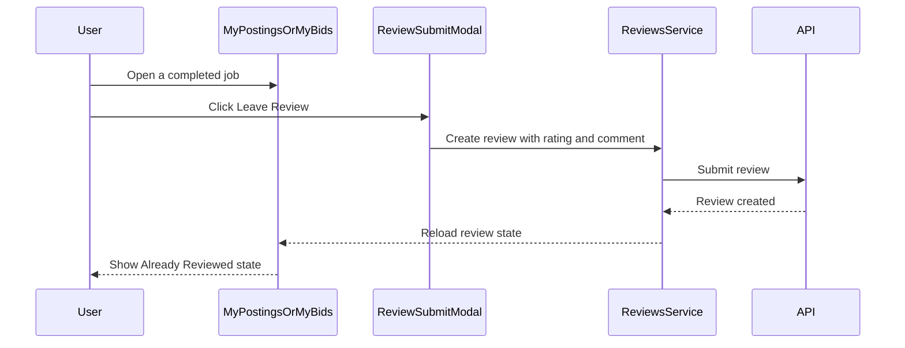

#### Review Eligibility Gate

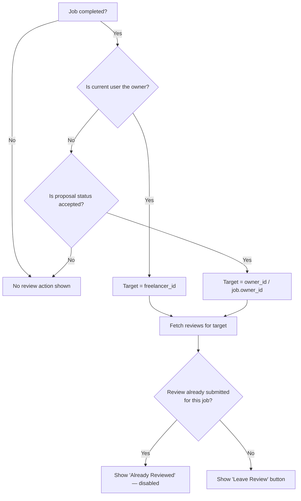

---

### UC7 — Language & Theme Switch

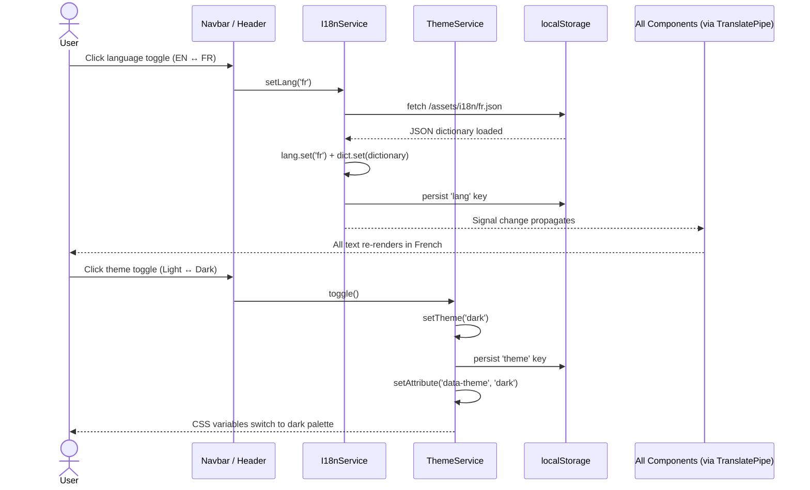

---

## Navbar Badge Reactivity

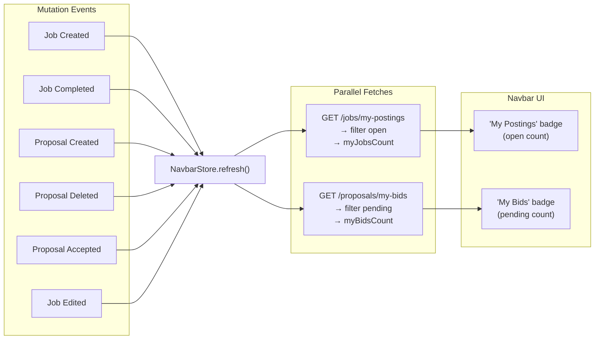

---

## i18n Architecture

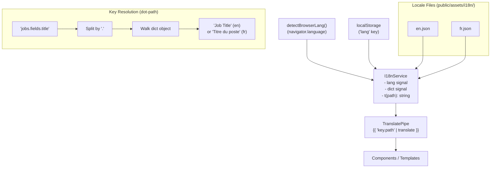

---

## Getting Started

### Prerequisites

- Node.js ≥ 20
- Angular CLI ≥ 21 (`npm install -g @angular/cli`)

### Install

```bash
npm install
```

### Development Server

```bash
ng serve
# or, without Hot Module Replacement:
npm start -- --no-hmr
```

Navigate to `http://localhost:4200/`. The app auto-reloads on file changes.

### Build

```bash
ng build
```

Artifacts are written to `dist/`. Production builds are optimised for performance.

### Tests

```bash
ng test
```

Runs unit tests with [Vitest](https://vitest.dev/).

### Code Scaffolding

```bash
ng generate component component-name
ng generate --help   # list all schematics
```

---

## Additional Resources

- [Angular CLI Reference](https://angular.dev/tools/cli)
- [Angular Signals](https://angular.dev/guide/signals)
- [Mermaid Diagram Syntax](https://mermaid.js.org/)
